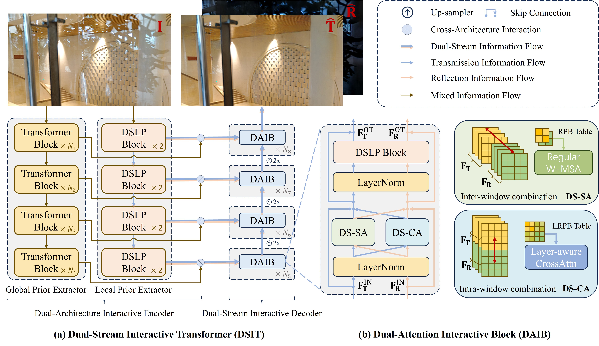

<p align="center">
  
</p>

## <div align="center"><b></b></div>

### 📖 DSIT: Single Image Reflection Separation via Interactive Dual-Stream Transformers (NeurIPS 2024)

> [[Paper](https://openreview.net/pdf?id=Shwtw8uV8l)] [[Poster](https://github.com/mingcv/DSIT_Sources/blob/main/assets/DSIT_NIPS2024_Poster.pdf)] [[PPT slides](https://github.com/mingcv/DSIT_Sources/blob/main/assets/DSIT_NIPS2024_Slides.pptx)]<br>
> [Qiming Hu](https://scholar.google.com/citations?user=4zasPbwAAAAJ), [Hainuo Wang](https://scholar.google.com/citations?user=Z2RcbF4AAAAJ), [Xiaojie Guo](https://sites.google.com/view/xjguo/homepage) <br>
> College of Intelligence and Computing, Tianjin University

### Network Architecture
<p align="center">
  
</p>

### Environment Preparation (Python 3.9)
```pip install -r requirements.txt```
### Data Preparation


#### Training dataset
* 7,643 images from the
  [Pascal VOC dataset](http://host.robots.ox.ac.uk/pascal/VOC/), center-cropped as 224 x 224 slices to synthesize training pairs;
* 90 real-world training pairs provided by [Zhang *et al.*](https://github.com/ceciliavision/perceptual-reflection-removal);
* 200 real-world training pairs provided by [IBCLN](https://github.com/JHL-HUST/IBCLN) (In our training setting 2, &dagger; labeled in our paper).

#### Testing dataset
* 45 real-world testing images from [CEILNet dataset](https://github.com/fqnchina/CEILNet);
* 20 real testing pairs provided by [Zhang *et al.*](https://github.com/ceciliavision/perceptual-reflection-removal);
* 20 real testing pairs provided by [IBCLN](https://github.com/JHL-HUST/IBCLN);
* 454 real testing pairs from [SIR^2 dataset](https://sir2data.github.io/), containing three subsets (i.e., Objects (200), Postcard (199), Wild (55)). 

Download all in one by [Google Drive](https://drive.google.com/file/d/1hFZItZAzAt-LnfNj-2phBRwqplDUasQy/view?usp=sharing) or [百度云](https://pan.baidu.com/s/15zlk5o_-kx3ruKj4KfOvtA?pwd=1231).
### Usage

#### Training 
Setting I (w/o Nature): ```python train_sirs_setting1.py --name dsit_large_train_setting1 --arch dsit_large --model dsit_model_sirs_lrm --dataset sirs_dataset --loss losses  --lambda_vgg 0.01 --lambda_rec 0.2 --size_rounded --seed 2024 --backbone_weight_path "./weights/swin_large_o365_finetune.pth" --base_dir "YOUR_DATA_DIR]" --batchSize 1```

Setting II (w/ Nature): ```python train_sirs_setting2.py --name dsit_large_train_setting2 --arch dsit_large --model dsit_model_sirs_lrm --dataset sirs_dataset --loss losses  --lambda_vgg 0.01 --lambda_rec 0.2 --size_rounded --seed 2024 --backbone_weight_path "./weights/swin_large_o365_finetune.pth" --base_dir "[YOUR_DATA_DIR]" --batchSize 1```

#### Evaluation 
Setting I (w/o Nature): ```python eval_sirs.py --name dsit_large_setting1_eval_epoch20 --arch dsit_large --model dsit_model_sirs_lrm --dataset sirs_dataset  --size_rounded --weight_path "./weights/dist-large-setting1-epoch20.pth" --backbone_weight_path "./weights/swin_large_o365_finetune.pth" --base_dir "[YOUR_DATA_DIR]"```

Setting II (w/ Nature): ```eval_sirs.py --name dsit_large_setting2_eval_epoch66 --arch dsit_large --model dsit_model_sirs_lrm --dataset sirs_dataset  --size_rounded --test_nature --weight_path "./weights/dist-large-setting2-epoch66.pth" --backbone_weight_path "./weights/swin_large_o365_finetune.pth" --base_dir "[YOUR_DATA_DIR]"```

#### Testing
```python test_sirs.py --name dsit_large_setting2_test_epoch66 --arch dsit_large --model dsit_model_sirs_lrm --dataset sirs_dataset  --size_rounded --test_nature --weight_path "./weights/dist-large-setting2-epoch66.pth" --backbone_weight_path "./weights/swin_large_o365_finetune.pth" --test_dir "[YOUR_TESTING_DATA_DIR]"```

#### Trained weights

Download the trained weights by [Google Drive](https://drive.google.com/drive/folders/1mImdAZdc2kUlJ1RWwzgaNon60jzpZfCh?usp=drive_link) and drop them into the "weights" dir.

### Visual comparison on real20 and SIR^2


### Generalizability on Our Additionally Captured Real World Cases


